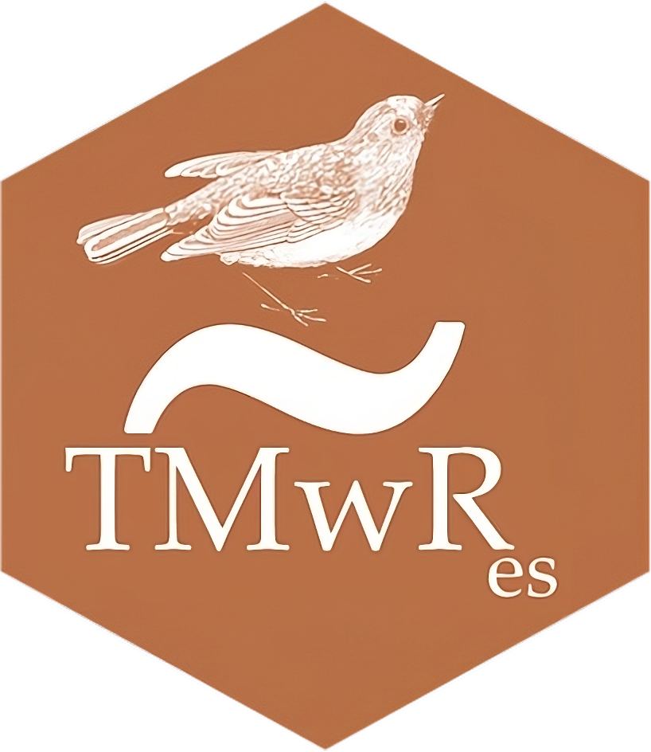

# Spanish

## Modelado Ordenado con R

<a href="https://amzn.to/35Hn96s"></a> Este repositorio contiene el código fuente del libro **"Modelado Ordenado con R"** de Max Kuhn & Julia Slige. El libro está construido usando [Quarto](https://quarto.org/).El propósito de este libro es demostrar cómo [tidyverse](https://www.tidyverse.org/) y [tidymodels](https://www.tidymodels.org/) se pueden utilizar para producir modelos de alta calidad.

## Sobre la traducción

Esta traducción de "Modelado Ordenado con R" es un proyecto personal de [David Díaz Rodríguez](https://github.com/davidrsch) con el objetivo de facilitar el estudio de construcción de modelos mediante el uso de R, tanto al propio traductor como a todas aquellas personas de habla hispana que deseen aprender sobre este tema.

Señalar que esta es una traducción textual del libro por lo que cuando los autores se refieren así mismo en primera persona, serán Max Kuhn & Julia Slige no el traductor.

La traducción fue realizada usando Google Translate y fueron corregidos algunos errores gramaticales y de coherencia. Si detecta algún error relacionado con el contenido de la traducción, siéntase libre de abrir un issue o un pull request en este [repositorio](https://github.com/davidrsch/TMwRes).

## Más información acerca del repositorio

### Reproducir el libro o los resultados.

Primero, deberá instalar los paquetes necesarios. Para hacer esto, primero instale el paquete `remotes`:

``` r
install.packages("remotes")
```

Luego use esto para instalar lo que necesita para crear el libro:

``` r
remotes::install_github("tidymodels/TMwR")
```

Aunque intentamos utilizar rigurosamente las versiones CRAN actuales de todos los paquetes, el código anterior puede instalar algunas versiones de desarrollo.

# English

## Tidy Modeling with R

<a href="https://amzn.to/35Hn96s"></a> This repository contains the source for [*Tidy Modeling with R*](https://tmwr.org) by Max Kuhn & Julia Slige. The book is built using [Quarto](https://quarto.org/). The purpose of this book is to demonstrate how the [tidyverse](https://www.tidyverse.org/) and [tidymodels](https://www.tidymodels.org/) can be used to produce high quality models.

## About the translation

This translation of "Tidy Modeling with R" is a personal project by [David Díaz Rodríguez](https://github.com/davidrsch) with the aim of daciltating the study of model building with R, both for the translator himself and for all those Spanish-speaking people who wish to learn about this topic.

Note that this is a verbatim translation of the book so when the authors refer to themselves in the first person, it will be Max Kuhn & Julia Slige not the translator.

The translation was done using Google Translate and some grammar and coherence errors were corrected. If you spot any issue related to the translation content, feel free to open an issue or pull request on this [repository](https://github.com/davidrsch/TMwRes).

## More info about the repository

### Reproducing the book or results

First, you'll need to install the required packages. To do this, first install the `remotes` package:

``` r
install.packages("remotes")
```

Then use this to install what you need to create the book:

``` r
remotes::install_github("tidymodels/TMwR")
```

Although we rigorously try to use the current CRAN versions of all packages, the code above may install some development versions.
